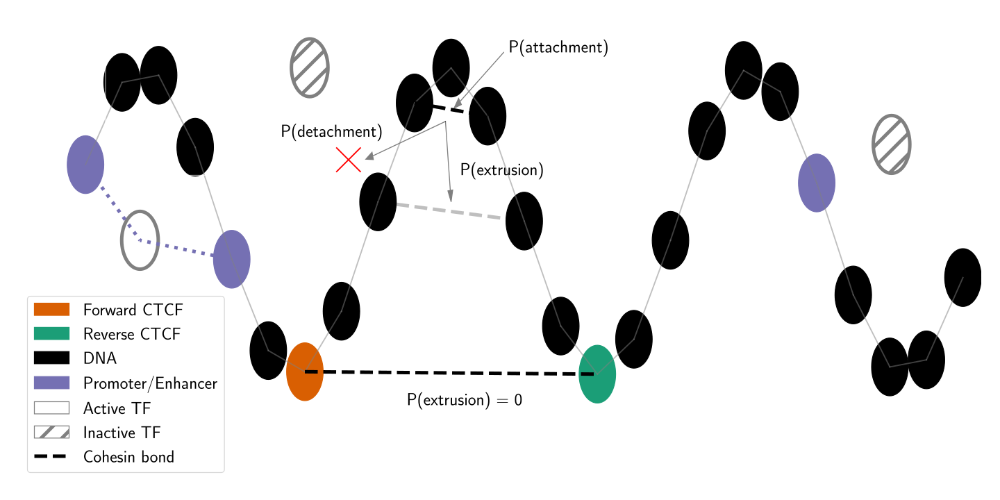

# HiCSim - Chromatin Fibre Simulations

## A workflow for modelling chromatin using polymer simulations.

HiCSim provides an accessible and user-friendly framework for performing chromatin polymer simulations.
The model implements a coarse-grained "bottom-up" approach to simulate a chromatin fibre from input genomic annotation data.
It includes functionality for performing *in silico* Hi-C, visualisation of simulated and experimental contact matrices and a model of transcriptional activation based on the work of [Brackley et al., 2021](https://www.nature.com/articles/s41467-021-25875-y)
The pipeline utilises the workflow management system Snakemake and automatically handles the installation of all required software with no user input.
HiCSim can also be easily scaled to work in cluster environments.

## Table of contents

  * [Model Summary](#model-summary)
  * [Implementation](#implementation)
  * [Installation](#installation)
  * [Configuration](#configuration)
  * [Usage](#usage)
  * [Example output](#example-output)
     * [HiC Contact Map](#hic-contact-map)
     * [Transcriptional Activity](#transcriptional-activity)
  * [References](#references)

## Model Summary
HiCSim implements a coarse-grained "bottom-up" approach to simulate a chromatin fibre.
The simulation represents the chromatin fibre as a chain of "beads" connected with springs which move according to Newtonian physics.
Input data (i.e. epigenetic, protein-binding or chromatin-state) are mapped onto the bead-polymer chain, and the underlying signal defines the behaviour of each bead.

### Mechanisms of chromatin dynamics
HiCSim incorporates two biological mechanisms influencing chromatin dynamics: protein bridges and cohesin loop-extrusion.

#### Protein Briges
Protein-bridge formation is modelled using freely diffusing monomers that represent generalised protein complexes.
These monomers randomly switch between active and inactive states and, in their active state, have an affinity for specific bead types.
Below, monomers represent RNA polymerase II transcription complexes (labelled TF) which have an affinity for beads labelled as promoters or enhancers.

#### Loop Extrusion
Loop-extrusion is modelled using transient bonds to represent cohesin rings.
These bonds may form spontaneously between adjacent beads according to some probability.
In subsequent time steps, the "cohesin-bonds" may extrude in either direction or detach according to defined probabilities.
Extrusion is halted in a particular direction if a bead corresponding to a convergently oriented CTCF is reached.



## Implementation
HiCSim is implemented as a user-friendly [Snakemake](https://snakemake.readthedocs.io/en/stable/getting_started/installation.html) workflow.
The user provides necessary input data (e.g. genomic annotations) and a configuration file defining simulation parameters.
Following configuration, HiCSim automatically installs software dependencies and executes the workflow described below.


## Installation

HiCSim works with python >=3.6 and requires [Snakemake](https://snakemake.readthedocs.io/en/stable/getting_started/installation.html).

The HiCSim repository can be downloaded from GitHub as follows:

```bash
git clone https://github.com/StephenRicher/HiCSim.git
```

## Configuring HiCSim

The HiCSim pipeline is fully controlled through a single configuration file that describes parameter settings and paths to relevant files in the system.
HiCSim is bundled with a pre-configured model of the GNG12-AS1 locus and corresponding experimental Hi-C data for visual comparison ([Rao et al., 2014](https://www.cell.com/fulltext/S0092-8674(14)01497-4)).
The configuration file for this model is shown below and can be found at `example/config/config.yaml`.

**Note:** If relative file paths are provided in the configuration file, then these are **relative to the working directory**.
The working directory (defined by "workdir") is relative to the directory ``snakemake``executed.
If not set, the working directory defaults to the directory containing the Snakefile.
Relative paths can be confusing; they are used here to ensure the example dataset works for all users.
If in doubt, provide absolute paths.

```bash
# Specify output directory - either an absolute path or relative to Snakefile.
# If using relative paths for subsequent files, these should be relative to
# this working directory.
workdir: example/analysis/

reps:         12    # Total replicates to run.
basesPerBead: 2000  # Number of bases represented by a single bead.
monomers:     200   # NUmber of freely-diffusing monomers (e.g. TFs)

# BED file of CTCF loci with orientation.
ctcf : ../data/GM12878-CTCF.bed

# BED files of genomic annotations mapped to specific bead type.
masking :
    ../data/wgEncodeBroadHmmGm12878HMM-strongEnhancer-hg19.bed: E
    ../data/wgEncodeBroadHmmGm12878HMM-weakEnhancer-hg19.bed:   e
    ../data/wgEncodeBroadHmmGm12878HMM-activePromoter-hg19.bed: P
    ../data/wgEncodeBroadHmmGm12878HMM-weakPromoter-hg19.bed:   p
retentionProb: 0.6 # Probability of retaining a given annotation.

# Path to file describing bead type coefficients.
coeffs: ../config/pair_coeffs.txt

genome :
    build:      hg19                         # Genome build name.
    chromSizes: ../data/hg19.chrom.sizes     # Path to chromosome sizes.
    genes:      ../data/UCSC-genes-hg19.bed  # BED file of genes.
    name:       GNG12                        # Simulation locus name.
    chr:        1                            # Simulation locus (chr:start-end)
    start:      65834000
    end:        70234000

# Alternatively, the user can provide a manually defined bead sequence(s)
# instead of genomic loci and annotation data.
# syntheticSequence:
#   ../data/syntheticSequence.txt

# Control randomness at various stages of the pipeline.
random :
    seed:       42         # Seed governing global simulation.
    walk:       False      # Set True to initialise as a random walk.
    sequence:   True       # Set True to generate a new bead sequence per rep
    simulation: True       # Set True to vary simulation conditions per rep

# Define simulation box dimensions
box :
    xlo: -50
    xhi:  50
    ylo: -50
    yhi:  50
    zlo: -50
    zhi:  50

# LAMMPS configuration
lammps :
    restart:        0       # Set 0 to turn off
    timestep:       0.01    # Simulation timestep.
    writeInterval:  20      # Snapshot write interval in Brownian time.
    warmUp:         100000  # Equilibration time in Brownian time.
    simTime:        100000  # Simulation time in Brownian time.
    noExtrusion:    False   # Set True to switch off the loop-extrusion model.
    TFswap:         100     # TF activation swap rate in Brownian time.
    extrudersPerMb: 8       # Density of loop extruders per megabase
    nSplit:         6       # Split data for parallel post-processing
    threads:        1       # Set LAMMPs MPI threads

GIF :
    create: True            # Set True to create VMD visualisation of polymer.
    delay:  10              # Time delay (1/100ths second) to pause after the loop.
    loop:   0               # Number of animations loops - set 0 for infinite.

HiC :
    colourMap: 'Purples'    # Matplotlib colourmap for HiC matrix.
    log:        True        # Set True to log transform contact frequencies.
    matrix:     ../data/GM12878-chr1.cool # Path to experimental HiC matrix.
    binsize:    6000        # Adjust simulated HiC to this resolution.

# Define configuration for plotting Radius of Gyration
plotRG :
    dpi:        300  # Resolution (dpi) of .png image.
    confidence: 0.95 # Confidence Interval

plotTU:
    alpha:    0.01 # Significance threshold for TU-TU interactions.
    vMin:    -0.2  # Minimum value to anchor heatmap / circos colour scheme.
    vMax:     0.2  # Maximum value to anchor heatmap / circos colour scheme.
    fontSize: 12   # Fontsize for plot labels.
```

## Usage

Once Snakemake is installed, the example dataset can be processed using the following command.
This command should be run from the HiCSim base directory containing the Snakefile.

```bash
snakemake --use-conda --cores 4 --configfile example/config/config.yaml
```

This command will install all relevant Conda environments within the defined working directory (`example/analysis/`) - this may take some time.
The pipeline should then run to completion producing the exact figures as shown in the example output below.
Alternatively, you may also want to install the Conda environments in a custom directory.
A custom directory is helpful if you perform multiple independent analyses and do not want to install the same Conda environments repeatedly.

```bash
snakemake --use-conda --conda-prefix /path/envs/ --cores 4 --configfile example/config/config.yaml
```

### Cluster Execution
All Snakemake-based pipelines, including HiCSim, are compatible with cluster environments.
Consult the official Snakemake documentation [here](https://snakemake.readthedocs.io/en/v5.25.0/executing/cli.html#profiles) to learn more about running HiCSim on your particular cluster environment.

## Example output
HiCsim automatically generates all figures shown below.

### Hi-C Contact Map
Following the molecular dynamics simulation, HiCSim performs *in silico* Hi-C to estimate contact frequencies between all pairs of loci.
The simulated Hi-C data is visualised as a contact matrix (see below, upper triangle).
If experimental data of the simulated locus is provided, this is also plotted for visual comparison (see below, lower triangle).


### Transcriptional Activity
HiCSim implements a model of transcriptional activity first described by [Brackley et al., 2021](https://www.nature.com/articles/s41467-021-25875-y).
Transcription Factors (TFs) are modelled as freely diffusing monomers that randomly oscillate between an *active* and *inactive* state.
During the simulation, beads representing Transcriptional Units (TUs) (corresponding to bead type P or p) are considered *activated* if there are within a given distance of an active TF.

*Note: the below visualisations are automated HiCSim outputs but are not part of the example dataset.*

#### Correlation Heatmap
Below is a heatmap of correlation coefficients describing correlated transcriptional activation between pairs of Transcriptional Units (TUs).


#### Circos Plot
Alternative visualisation of significantly correlated interactions represented as a circos plot.
For each TU-TU pair, the median p-value across replicate simulations is selected.
P-values are adjusted using FDR correction, and significant interactions are identified according to the user-configured alpha value.


### Co-localisation of Transcriptional Units
Correlation in transcriptional activity may be associated with co-localisation of transcriptional units.
HiCSim performs unsupervised clustering of the positional coordinates using DCSCAN to identify clusters of co-localisation.
Each clustering is determine from a snapshop in time for each replicate, as visualised below.


 <br> *Unsupervised clustering, using DBSCAN, detects 3D co-localisation of transcriptional units.*

#### Mean co-localisation
Co-localisation can also be visualised using an aggregate approach.
For each simulation, the average proportion of time each pair of transcriptional units are in the same cluster is calculated.
This value is averaged across replicates to provided a single value, for each TU-TU pair, corresponding to co-localisation frequency.


 <br> *Co-localisation frequency, of each TU-TU, across all simulation replicates.*

### Loop Extrusion Progression
Throughout the simulation, HiCSim monitors the progression and position of Loop Extruding Factors.


 <br> *Visual representation of Loop Extrusion Factors across the simulation time, for a given replicate.*


## References
Brackley, C.A., Gilbert, N., Michieletto, D., Papantonis, A., Pereira, M.C., Cook, P.R.
and Marenduzzo, D., 2021. Complex small-world regulatory networks emerge from
the 3D organisation of the human genome. Nature communications, 12(1). Available
from: https://doi.org/10.1038/s41467-021-25875-y.

Rao, S.S.P., Huntley, M.H., Durand, N.C., Stamenova, E.K., Bochkov, I.D., Robinson,
J.T., Sanborn, A.L., Machol, I., Omer, A.D., Lander, E.S. and Aiden, E.L., 2014. A
3D map of the human genome at kilobase resolution reveals principles of chromatin
looping. Cell [Online], 159(7), pp.1665–80. Available from: https://doi.org/10.
1016/j.cell.2014.11.021.
